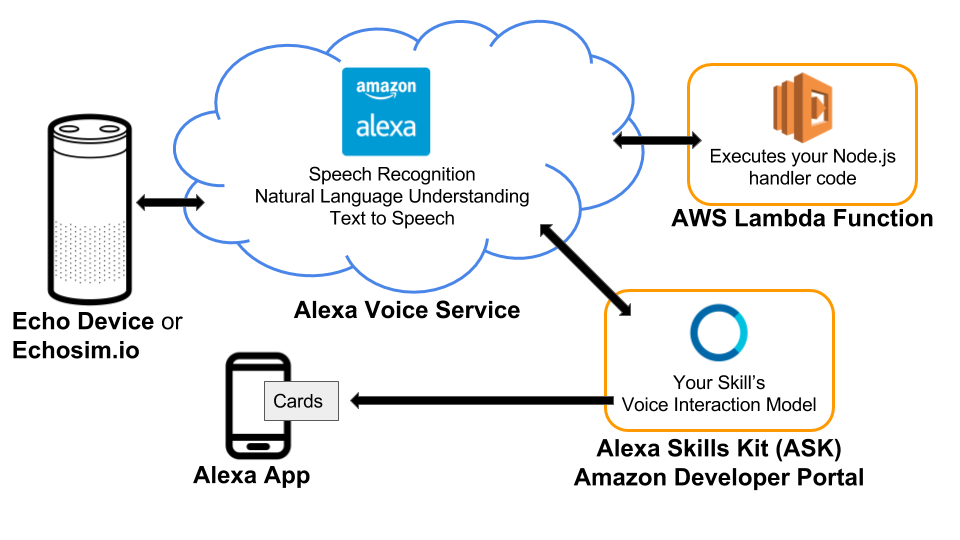
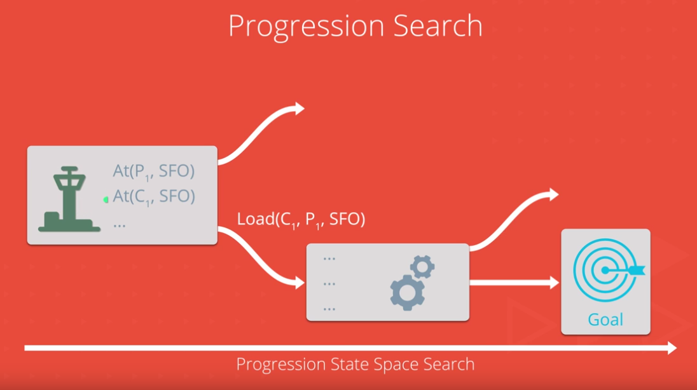
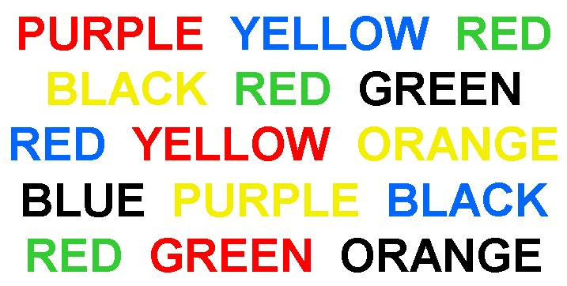
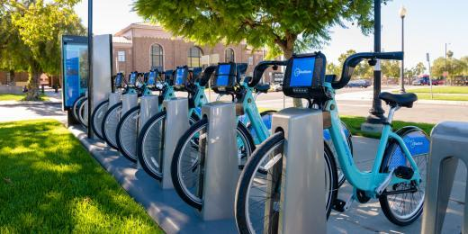

> _I love tech innovations, especially in the consumer services and electronics space.
> Interest include mobile development, web development, and machine learning._
>
> **Jonathan Sullivan**

 

 

-----

#  Portfolio
_Below is a Portfolio of my work that I have done._

##  Robotics Engineering Projects
**Robots are enhancing productivity, safety, and efficiency across whole industries—from manufacturing and healthcare to agriculture, construction, and transportation. In the process, we are being freed to pursue more creative, ambitious, and intellectual achievements. Incredible new opportunities are emerging, but they require specialized skills.**

### Search and Sample Return Project

This project is modeled after the NASA sample return challenge. In a simulated environment, I programed a space rover to search for environmental samples using some basic computer vision techniques. With just a few lines of Python code I got a chance to experience the three main steps in the robotics process: perception, decision making, and actuation. I carried out this project in a simulator environment built with the Unity game engine.

#### [View on Github](https://github.com/JonathanKSullivan/Search-and-Sample-Return) 

#### Technologies Used
- Python 3.6
- Numpy
- Jupyter Notebook
- OpenCV

##  Deep Learning Engineering Projects
**Artificial Intelligence is transforming our world in dramatic and beneficial 
ways, and Deep Learning is powering the progress.**

==============

### Face Generation

In this project, I used deep convolutional generative adversarial networks to generate new images of faces and numbers.

#### [View on Github](https://github.com/JonathanKSullivan/Generate-Faces) 

#### Technologies Used
- Python 3.6
- Jupyter Notebook
- Numpy
- Tensorflow
- OpenCV

### Translation Project

In this project, I took a peek into the realm of neural network machine translation. I trained a sequence to sequence model on a dataset of English and French sentences that can translate new sentences from English to French.

#### [View on Github](https://github.com/JonathanKSullivan/Translation-Project) 

#### Technologies Used
- Python 3.6
- Jupyter Notebook
- Tensorflow

###  TV Script Generation

In this project, I generated my own Simpsons TV scripts using RNNs. I usied part of the Simpsons dataset of scripts from 27 seasons. The Neural Network I build will generate a new TV script for a scene at Moe's Tavern.

#### [View on Github](https://github.com/JonathanKSullivan/Generate-TV-Scripts) 

#### Technologies Used
- Python 3.6
- Jupyter Notebook
- Tensorflow

### Image Classification

In this project, I classified images from the CIFAR-10 dataset. The dataset consists of airplanes, dogs, cats, and other objects. The dataset was to be preprocessed, then trained on a convolutional neural network. I normalized the images, one-hot encoded the labels, build a convolutional layer, max pool layer, and fully connected layer. At the end, you can see its predictions on the sample images.

#### [View on Github](https://github.com/JonathanKSullivan/Image-Classification) 

#### Technologies Used
- Python 3.6
- Jupyter Notebook
- Tensorflow

### First Neural Network

In this project, I got to build a neural network from scratch to carry out a prediction problem on a real dataset! By building a neural network from the ground up, I have a much better understanding of gradient descent, backpropagation, and other concepts that are important to know before mastering higher level toolssuch as Tensorflow. I also got to see how to apply these networks to solve real prediction problems!

#### [View on Github](https://github.com/JonathanKSullivan/First-Neural-Network) 

#### Technologies Used
- Python 3.6
- Jupyter Notebook
- Numpy

===============

##  Artificial Intellegence Engineering Projects
**Artificial intelligence is the future of computer science and technology. Its 
impact will be almost immeasurable. The field is wide open today, with so much 
to learn, and so many ways to contribute. Global innovations in the field of 
artificial intelligence (AI) are going to redefine virtually every aspect of our
lives. By mastering AI skills I will play a critical role in helping determine 
how this incredible technology impacts our future.**

### Facial Keypoint Detection

In this project, I combined my knowledge of computer vision techniques and deep 
learning to build and end-to-end facial keypoint recognition system. Facial 
keypoints include points around the eyes, nose, and mouth on any face and are 
used in many applications, from facial tracking to emotion recognition. My code 
is able to take in any image containing faces and identify the location of each 
face and their facial keypoints.

#### [View on Github](https://github.com/JonathanKSullivan/Facial-Keypoint-Detection) 

#### Technologies Used
- Python 3.6
- Jupyter Notebook
- Keras
- Tensorflow
- OpenCV
- matplotlib
- Amazon EC2

### Mimic Me!

In this project, I learned to track faces in a video and identify facial 
expressions using Affectiva. As a fun visualization, I taged each face with an 
appropriate emoji next to it. I then turned this into a game where the player 
needs to mimic a random emoji displayed by the computer!

#### [View on Github](https://github.com/JonathanKSullivan/MimicMe) 

#### Technologies Used
- JavaScript
- Affectiva

### Time Series and Text Generation with RNN

Used Recurrent Neural Networks (RNN) to build RNNs that can generate sequences 
based on input data - with a focus on two applications: With the first I used 
real market data in order to predict future Apple stock prices using an RNN 
model. The second one is trained on Sir Arthur Conan Doyle's classic novel 
Sherlock Holmes and will generate wacky sentences based on it that may - or may 
not - become the next great Sherlock Holmes novel!

#### [View on Github](https://github.com/JonathanKSullivan/text_generation) 

#### Technologies Used
- Jupyter Notebook
- Python 3.6
- Keras
- Tensorflow
- Numpy
- Matplotlib
- Amazon EC2

### Dog Breed Classifier

Used Convolutional Neural Networks (CNN) to build a pipeline to process 
real-world, user-supplied images. Given an image of a dog, my algorithm will 
identify an estimate of the canine’s breed. If supplied an image of a human, 
the code will identify the resembling dog breed.

Along with exploring state-of-the-art CNN models for classification, I made 
important design decisions about the user experience for your app. My goal was 
to understand the challenges involved in piecing together a series of models 
designed to perform various tasks in a data processing pipeline. Each model has 
its strengths and weaknesses, and engineering a real-world application often 
involves solving many problems without a perfect answer. My imperfect solution 
will nonetheless create a fun user experience!

#### [View on Github](https://github.com/JonathanKSullivan/dog_breed_classifier) 

#### Technologies Used
- Jupyter Notebook
- Python 3.6
- Keras
- Tensorflow
- PIL
- Sklearn
- Numpy
- Matplotlib
- OpenCV
= Amazon EC2

### BookWorm

In this project, I used IBM Watson's NLP Services to create a simple 
question-answering system. I first used the Discovery service to pre-process a 
document collection and extract relevant information. I used the Conversation 
service to build a natural language interface that can respond to questions.

#### [View on Github](https://github.com/JonathanKSullivan/BookWorm) 

#### Technologies Used
- Python 3.6
- Jupyter Notebook
- Bluemix Discovery API
- Bluemix Conversation API

### Alexa History Skill

In this project, I built a fully functional skill for Amazon’s Alexa that 
provides year-dated facts from AI History (or some other History of my 
choosing). Through the process, I got to use the Alexa Skills Kit (ASK) - a 
current state of the art API for building voice systems.

#### [View on Github](https://github.com/JonathanKSullivan/Alexa-History-Skill) 

#### Technologies Used
- JavaScript
- Alexa Skills Kit
- Amazon Lambda

### Sign Language Recognizer

In this project, I built a system that can recognize words communicated using 
the American Sign Language (ASL). I was provided a preprocessed dataset of 
tracked hand and nose positions extracted from video. My goal was to train a set
of Hidden Markov Models (HMMs) using part of this dataset to try and identify 
individual words from test sequences.

As an optional challenge, I am incorporating Statistical Language Models (SLMs) 
that capture the conditional probability of particular sequences of words 
occurring. This should help me you improve the recognition accuracy of my 
system.

#### [View on Github](https://github.com/JonathanKSullivan/Sign-Language-Recognizer) 

#### Technologies Used
- Jupyter Notebook
- Python 3.6
- Numpy
- Pandas
- hmmlearn
- matplotlib

### Pacman Search Agent

In this project, my Pacman agent found paths through his maze world, both to 
reach a particular location and to collect food efficiently. I built general 
search algorithms, such as breadth first search, depth first search, Uniform 
Cost Search, Astar Search and applied them to Pacman scenarios, such as finding 
corners and eating all of the food.

#### [View on Github](https://github.com/JonathanKSullivan/Pacman-With-AI) 

#### Technologies Used
- Python 2.7
- Breadth first search
- Depth first search
- Uniform Cost Search 
- Astar Search
- PyGame

### Solving the N-Queens problem

Explored Constraint Satisfaction Problems by implementing the N-Queens problem 
using symbolic constraints in a Jupyter notebook, and solving it using the 
Backtracking Search algorithm from AIMA.

#### [View on Github](https://github.com/JonathanKSullivan/8-Queens-with-AI) 

#### Technologies Used
- Python 3.6
- aima-python

### Air Cargo transport system using a planning search

In this project, I defined a group of problems in classical PDDL 
(Planning Domain Definition Language) for the air cargo domain. I then set up 
the problems for search, experimented with various automatically generated 
heuristics, including planning graph heuristics, to solve the problems, and then
provided an analysis of the results. Additionally, I wrote a short research 
review paper on the historical development of planning techniques and their use 
in artificial intelligence.

#### [View on Github](https://github.com/JonathanKSullivan/Air-Cargo-Planning-Problem) 

#### Technologies Used
- Python 3.6
- aima-python

### Isolation Game-playing Agent

In this project, I developed an adversarial search agent to play the game 
"Isolation". Isolation is a deterministic, two-player game of perfect 
information in which the players alternate turns moving a single piece from one 
cell to another on a board. Whenever either player occupies a cell, that cell 
becomes blocked for the remainder of the game. The first player with no 
remaining legal moves loses, and the opponent is declared the winner. These 
rules are implemented in the isolation.Board class provided in the repository.

This project uses a version of Isolation where each agent is restricted to 
L-shaped movements (like a knight in chess) on a rectangular grid (like a chess 
or checkerboard). The agents can move to any open cell on the board that is 
2-rows and 1-column or 2-columns and 1-row away from their current position on 
the board. Movements are blocked at the edges of the board (the board does not 
wrap around), however, the player can "jump" blocked or occupied spaces (just 
like a knight in chess).

Additionally, agents will have a fixed time limit each turn to search for the 
best move and respond. If the time limit expires during a player's turn, that 
player forfeits the match, and the opponent wins.

I modified code in the game_agent.py file to complete the project. Additional 
files include example Player and evaluation functions, the game board class, and
a template to develop local unit tests.

My analysis concludes with a comparison of different heuristics and my reasoning
for choosing the heuristic I ultimately used in my agent.

The second part of this project I read a seminal paper(Game Tree Searching by 
Min / Max Approximation by Ron Rivest, MIT) in the field of Game-Playing and 
wrote a simple one page summary on it.

#### [View on Github](https://github.com/JonathanKSullivan/Isolation-With-AI) 

#### Technologies Used
- Python 3.6
- Minimax Search
- Alpha-Beta Pruning
- PyGame

### Diagonal Sudoku Solver

In this project, I wrote code to implement two extensions of a sudoku solver. 
The first one implements the technique called "naked twins". The second one 
modifies existing code to solve a diagonal sudoku. My goals were to implement 
the naked twins function and write an AI agent that solves the Diagonal Sudoku 
game.

#### [View on Github](https://github.com/JonathanKSullivan/Sudoku-With-AI) 

#### Technologies Used
- Python 3.6
- Algorithms for solving SAT
- PyGame

### Solving the Traveling Salesman Problem with Simulated Annealing

In this exercise I demonstrate understanding of simulated annealing by 
implementing the algorithm in a Jupyter notebook and using it to solve the 
Traveling Salesman Problem (TSP) between US state capitals.

#### [View on Github](https://github.com/JonathanKSullivan/Traveling-Saleman-with-AI) 

#### Technologies Used
- Jupyter Notebook
- Python 3.6
- json
- numpy
- matplotlib

-----

##  Machine Learning Engineering Projects
**Machine learning represents a key evolution in the fields of computer science,
data analysis, software engineering, and artificial intelligence. I enjoy 
applying predictive models to massive data sets in fields like finance, 
healthcare, education, and more.**

### Stock Price Predictor

Used supervised learning to study 5 high-valued equities in the technology 
sector and make price predictions. This is the capstone project for the 
Udacity's Machine Learning Nanodegree.

#### [View on Github](https://github.com/JonathanKSullivan/Stock-Price-Predictor) 

#### Technologies Used
- Python 2.7
- NumPy
- pandas
- scikit-learn (v0.17)
- matplotlib
- Quandl

### Train a Smart Cab

Used reinforcement learning techniques to construct a demonstration of a 
smartcab operating in real-time.

#### [View on Github](https://github.com/JonathanKSullivan/SmartCab) 

#### Technologies Used
- Python 2.7
- PyGame

### Creating Customer Segments

Use unsupervised learning techniques to see if any similarities exist between 
customers, and how to best segment customers into distinct categories.

#### [View on Github](https://github.com/JonathanKSullivan/CustomerSegments) 

#### Technologies Used
- Python 2.7
- NumPy
- pandas
- scikit-learn (v0.17)
- matplotlib

### Predicting Boston Housing Prices

Built an optimal model based on a statistical analysis to estimate the best selling price for a client’s home. Used the Boston Housing dataset which contains aggregated data on various features for houses in Greater Boston communities.

#### [View on Github](https://github.com/JonathanKSullivan/BostonHousing) 

#### Technologies Used
- Python 2.7
- NumPy
- pandas
- scikit-learn (v0.17)
- matplotlib
- Jupyter Notebook

### Student Intervention System

Constructed an intervention system that leverages supervised learning 
techniques. Developed a model that will predict the likelihood that a given 
student will pass, quantifying whether an intervention is necessary.

#### [View on Github](https://github.com/JonathanKSullivan/StudentIntervention) 

#### Technologies Used
- Python 2.7
- NumPy
- pandas
- scikit-learn (v0.17)
- matplotlib

### Titanic Survival Exploration

Created decision functions that attempt to predict survival outcomes from the 
1912 Titanic disaster based on each passenger’s features, such as sex and age.

#### [View on Github](https://github.com/JonathanKSullivan/TitanicSurvival) 

#### Technologies Used
- Python 2.7
- Jupiter Notebook
- NumPy
- pandas
- matplotlib

-----

##  iOS Development Projects
**Swift is a new language for programming iOS and OS X apps that was first 
introduced in June 2014. I build iOS apps sophisticated and polished user interfaces 
with UIKit components, implementing Core Data for local persistence of an object 
structures and external APIs to make use of third-party data**

### Virtual Tourist

Developed an app that allows you to drop pins on a map and pull up Flickr images
associated with that location. Stored locations and images using Core Data. 

#### [View on Github](https://github.com/JonathanKSullivan/Virtual-Tourist) 

#### Technologies Used
- XCode
- Swift
- UIkit

### On the Map

Developed an iOS app that adds my current location to a map of locations for other Nanodegree students it also posts a link to my own portfolio for others to see. 
This is the third project in the Udacity iOS Nanodegree Program.

#### [View on Github](https://github.com/JonathanKSullivan/On-The-Map) 

#### Technologies Used
- XCode
- Swift
- UIkit

### MemeMe

Developed an iOS app that takes a photo, and overlay text to meme-ify your 
friends. Then share on your favorite social channels! 

#### [View on Github](https://github.com/JonathanKSullivan/MemeMe) 

#### Technologies Used
- XCode
- Swift
- UIkit

### Pitch Perfect

Developed an iOS app that records a message and plays the audio back through user-selected filters. 

#### [View on Github](https://github.com/JonathanKSullivan/Pitch-Perfect) 

#### Technologies Used
- XCode
- Swift
- UIkit

-----

##  Web Development Projects

In today's web building beautiful, responsive websites optimized for mobile and 
desktop performance and complex server-side web applications that use powerful 
relational databases to persistently store data is must. I used HTML and the 
Bootstrap CSS framework to create my portfolio, and jQuery’s DOM manipulation to
dynamically populate your resume. I also developed my own arcade game in 
JavaScript, built complex mapping applications using the Knockout framework, and
used the Jasmine testing framework to develop and maintain applications. I've 
hone my understanding of how the web works, developed complex relational 
databases used to store applications data, secured and configured my own 
Linux-based servers, and builtcomplete web applications using Python, HTML, CSS,
JavaScript and SQL. My portfolio clearly demonstrate key skills mastery.

### Classic Arcade Game Clone

Adapted remake of the classic frogger game given assets and game loop engine 
from Udacity. 

#### [View on Github](https://github.com/JonathanKSullivan/Classic-Arcade-Game-Clone) 

#### Technologies Used
- HTML
- JavaScript

### Feed Reader Testing

Developed a series of jasmine.js test suites for a web-based application that 
reads RSS feeds. 

#### [View on Github](https://github.com/JonathanKSullivan/Feed-Reader-Testing) 

#### Technologies Used
- HTML5
- CSS3 
- JavaScript
- JasmineJS

### Interactive Resume

Developed an interactive resume application that reads my resume content from a 
JSON file and dynamically displays that content within a provided template.

#### [View on Github](https://github.com/JonathanKSullivan/Interactive-Resume) 

#### Technologies Used
- HTML5
- CSS3 
- Java
- JQuery

### Movie Trailer Website

A simple movie trailer website that uses Python, JavaScript, and CSS. 

#### [View on Github](https://github.com/JonathanKSullivan/Movie-Trailer-Website) 

#### Technologies Used
- Python
- HTML5
- CSS3

### Neighborhood Map

Developed a single-page application featuring a map of my neighborhood 
including: map markers to identify popular locations or places you’d like to 
visit, a search function to easily discover these locations, and a listview to 
support simple browsing of all locations. 

#### [View on Github](https://github.com/JonathanKSullivan/Neighborhood-Map) 

#### Technologies Used
- HTML5
- CSS3
- JavaScript
- JQuery

### Portfolio Site

Series of responsive portfolio sites designed from a given mockup from Udacity. 
This is the first project in the Udacity Frontend Nanodegree Program

#### [View on Github](https://github.com/JonathanKSullivan/Portfolio-Site) 

#### Technologies Used
- HTML5
- Bootstrap
- CSS3

### Tournament Results

Displayed information about faux tournament results using Python from a Postgres
database. 

#### [View on Github](https://github.com/JonathanKSullivan/Tournament-Results) 

#### Technologies Used
- Python
- psycopg2
- Postgre SQL

-----

##  Data Science Projects
As a Data Analyst, I obtain, analyze, and effectively report on data insights 
ranging from business metrics to user behavior and product performance. My 
projects demonstrate my ability to organize data, uncover patterns and insights, 
make predictions using machine learning, and clearly communicate critical 
findings.

### Stroop Effect

Analyzed the Stroop effect, a classic result of experimental psychology using 
descriptive statistics and statistical test.

#### [View on Github](https://github.com/JonathanKSullivan/Stroop-Effect) 

#### Technologies Used
- Python 2.7
- NumPy
- pandas
- Jupyter Notebook

### Chopsticks

Analysis of the results of an experiment testing the optimal length of 
chopsticks. 

#### [View on Github](https://github.com/JonathanKSullivan/Chopsticks) 

#### Technologies Used
- Python 2.7
- NumPy
- pandas
- Jupyter Notebook

### Bay Area Bike Share Analysis

Worked with real data provided by Bay Area Bike Share to determine differences 
in usage between commuters and tourists ridership patterns, average duration of 
trips, and more!

#### [View on Github](https://github.com/JonathanKSullivan/Bay-Area-Bike-Share) 

#### Technologies Used
- Python 2.7
- NumPy
- pandas
- Jupyter Notebook

# About Me

Hello, my name is Jonathan Sullivan and welcome to my portfolio site. Below you 
will have a chance to learn more about me and see some of my work that I have 
done. I am very interested in Math and Computer Science. My latest work has been
in the areas of Artificial Intellegence, Machine Learning, and Deep Learning. 
However I also love to build web and iOS apps. We as a society are athe the next
major turning point in technology. We are leaving the digital age and entering 
the age of data and Machine Intellegence. My goals is to contribute to the next
wave of technology that change the world for the better.

##  Education

### Udacity

My recent educational experience has been with a company, that I love. Udacity 
provide free class in programming and software engineering and paid Nanodegrees 
that focus on various fields. As a millenial new college grad living with his 
supportive parents. I started to spend 8-10 hours on this site daily. I was so 
amazed at the amount of material in so many fields of software engineering. This
was also my first time using python, Java was my language of choice at the time. I 
used these resources to learn how to build iphone apps, and website apps. I also
learned skill in data science like Data Wrangling, Exploratory Data Analysis, 
Data Visualization, Machine Learning, Deep Learning, and Artificial Intellegence.

### University of North Texas (UNT)

After leaving DCCCD were I had taken all possible math, Natural Science and 
computer engineering availible, I entered the university of North Texas. Here I 
majored in math and was pursuing a minor in Computer Engineering, Physics, 
Biology and Chemistry. Funny Story, my parent's who paid my tutition, told me a 
semster before I took my last semester of Physics, Biology and Chemistryc ourses, that If I
had the credit to graduate and didnt they I would have to pay for 
it. So I ended up graduating with a major in math and a minor in computer 
science. 

### Dallas County Community College (DCCCD)

The next step into futhering my technical experience took place almost 5 years
later. At this time I also was a single father of a beutiful 4 years old little 
girl and a unborn son. While being a parent came with it on set of challenges, I
had a support network which allowed me to enroll in Dallas County Community
College District (DCCCD). I started to fall inlove with math. Not just because 
of the enthusiastic proffesor at DCCCD but also because of a man named Sal Khan 
and his organization Khan academy. This site allowed me to grab a firm understanding 
of advanded mathematics like Linear Algebra, Vector Calculus, and Differential 
Equations I started majoring in Computer Engineering but part way through I was 
convinced by my Differential Eqautions teacher to become a Math major. 

### School of Science and Engineering at Yvonne A. Ewell Magnet Center (SEM)

I have always had an intellectual curiosity especially when it comes to science.
I would say that my first relevant educational experience began in High School.
I was fortunate to go [School of Science and Engineering at Yvonne A Ewell 
Townview Magnet Center]("https://www.usnews.com/education/best-high-schools/
texas/districts/dallas-independent-school-district/
school-of-science-and-engineering-18934"). The school has been named among the 
highest-performing high schools in the country according to national \
publications' rankings (U. S. News & World Report, Newsweek, Washington Post).
In fact, when I graduated after attending school there for 3 years, we were 
ranked the number 1 school in the nation. In that same ,year the school was 
named a National Blue Ribbon School of Excellence by the United States 
Department of Education. Upon Graduation I had taken and made a score of '5' on 
both the 'AP Biology' and 'AP Computer Science A'. I also had taken a 
College Physics and General Chemistry course, allowing me to enter college at 16
with sophmore credits. 

##  Experience
### Sites I have worked on:
- [TWC Buisiness Class Website](https://business.timewarnercable.com/) 
- [Qualitaxas](www.qualitaxas.com/) (active- Work In Progress)
- [Event Map for Progrexas.com](http://map.freestuffdfw.com/) (inactive)
- [Gary Stuard For US Congress Campaign](www.stuard2016.com/) (inactive)
- [Resume](www.jonathanksullivan.com/) (outdated)

##  Skills
Here are a list of my skills:

- Python
- Pandas
- Sklearn
- Numpy
- R Programming
- Mathematics
- Swift
- SQL
- HTML
- SASS
- AngularJS
- JavaScript
- Postgre SQL
- SQLite
- Linux
- MongoDB
- CSS
- Mathematical Analysis
- C++
- Mathematica
- Maple
- Microsoft Excel
- Matlab/Scilab
- Amazon EC2
- Keras
- Jupyter Notebook
- matplotlib
- hmmlearn
- Alexa Skills Kit
- Amazon Lambda
- Bluemix Discovery API
- Bluemix Conversation API
- Affectiva
- Search
- Game Playing Agents
- Convolutional Neural Networks
- Recurrent Neural Networks
- Hidden Markov Models
- Planning
- Constraint Satisfaction
- Deep Neural Networks
- Computer Vision
- Natural Language Proccessing
- Voice User Interfaces
- Simulated Annealing
- Bayes Nets